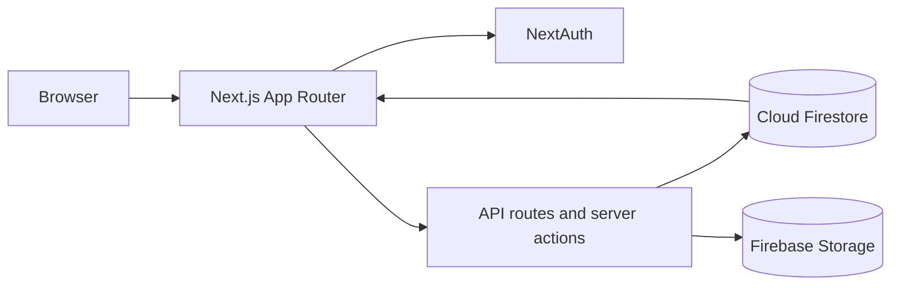

# artechbid

<p align="center">
  A full-stack digital art auction experience built with Next.js and Firebase.
</p>

<p align="center">
  
  
  
  
  <a href="LICENSE"></a>
</p>

artechbid lets people publish artwork as timed auctions, discover live and
completed listings, place bids, and follow auction activity from one responsive
interface.

## Highlights

- Create timed auctions with JPEG or PNG artwork uploads.
- Browse all, live, and ended auctions from filterable views.
- Place progressively higher bids with transactional Firestore writes.
- Prevent creators from bidding on their own artwork.
- Notify the previous bidder when they have been outbid.
- Track your own live and completed artwork listings.
- Sign up and sign in with credential-based authentication.

## How it works



The App Router renders the auction catalogue and detail pages. NextAuth handles
credential sessions, while server actions and API routes coordinate artwork
uploads, bids, and notifications with Firebase.

## Tech stack

| Area | Tools |
| --- | --- |
| Application | Next.js 14, React 18, TypeScript |
| Interface | Tailwind CSS, shadcn/ui, Radix UI, Lucide |
| Forms | React Hook Form, Zod |
| Data and files | Cloud Firestore, Firebase Storage |
| Authentication | NextAuth v5 credentials provider, bcrypt |
| Deployment | Vercel |

## Getting started

### Prerequisites

- Node.js 20 or newer
- [pnpm](https://pnpm.io/) 9 or newer
- A Firebase project with Firestore and Storage enabled

### Local setup

1. Clone the repository.

   ```bash
   git clone https://github.com/J3E1/artechbid.git
   cd artechbid
   ```

2. Install the locked dependencies.

   ```bash
   pnpm install --frozen-lockfile
   ```

3. Create your local environment file.

   ```bash
   cp .env.example .env.local
   ```

4. Add the Firebase web app configuration from the
   [Firebase console](https://console.firebase.google.com/) and generate an
   authentication secret.

   ```bash
   openssl rand -base64 32
   ```

   Paste that output into `AUTH_SECRET` in `.env.local`.

5. Start the development server.

   ```bash
   pnpm dev
   ```

6. Open [http://localhost:3000](http://localhost:3000).

> [!IMPORTANT]
> Configure Firestore and Storage rules for your own threat model before using
> the app with production data. Do not use blanket public read/write rules in a
> production Firebase project.

## Project structure

```text
src/
├── app/
│   ├── (auth)/          # Sign-in and registration pages
│   ├── api/             # Auction, authentication, and notification routes
│   └── auctions/        # Catalogue, creation, detail, and personal views
├── components/          # Auction and shared UI components
└── lib/
    ├── actions.ts       # Authentication and auction server actions
    ├── firebase.ts      # Firebase clients and collection references
    ├── schemas.ts       # Zod validation schemas
    └── utils.ts         # Auction queries, bidding, and notifications
```

## Available commands

| Command | Purpose |
| --- | --- |
| `pnpm dev` | Run the local development server |
| `pnpm build` | Create a production build |
| `pnpm start` | Serve the production build |
| `pnpm lint` | Run the Next.js ESLint checks |

## Contributing

Issues and pull requests are welcome. For a code change:

1. Fork the repository and create a focused branch.
2. Run `pnpm lint` and `pnpm build`.
3. Explain the user-facing impact in the pull request.

If you are planning a larger change, open an issue first so the approach can be
discussed.

## Roadmap

- OAuth sign-in options
- User settings and profile customization
- Shareable artwork pages
- Email notification support

## Acknowledgements

The visual direction was inspired by this
[NFT auction concept on Dribbble](https://dribbble.com/shots/19414536-Auktion-NFT-Auction-Site).

## License

Distributed under the [MIT License](LICENSE).
